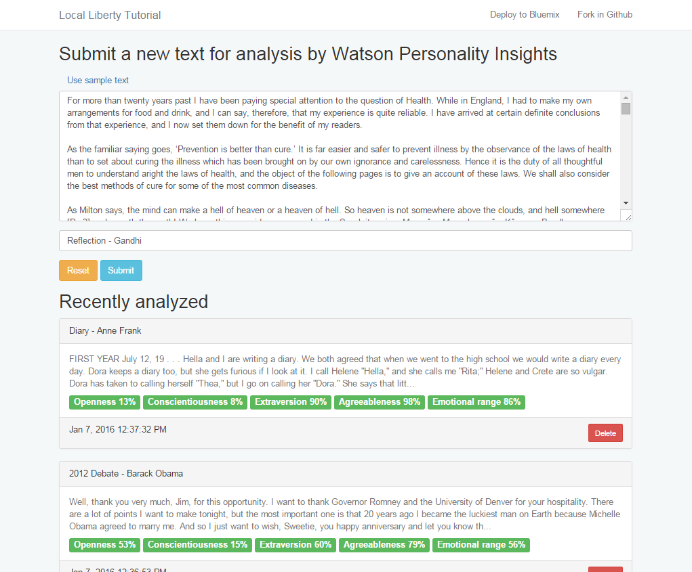

# Tutorial for local development with Liberty for Java™ 

This project provides a walkthrough on how to develop your Liberty application locally 
while using IBM Bluemix services in the cloud or their local equivalents when available.

If you are not going to follow the tutorial steps but want to quickly get the app deployed in Bluemix, use the Deploy to Bluemix button:

[](https://bluemix.net/deploy)

## How it works

The sample application uses the following runtime and services:

  * [Liberty for Java™](https://www.ng.bluemix.net/docs/starters/liberty/index.html)
  * [Cloudant NoSQL DB](https://www.ng.bluemix.net/docs/services/Cloudant/index.html)
  * [Personality Insights](https://www.ng.bluemix.net/docs/services/PersonalityInsights/index.html)
   
In this application, the user submits a text for analysis, optionally providing a description.
The text is sent to Personality Insights and the results are displayed.



## Running the app on Bluemix

If you are only looking to get this app deployed in your Bluemix account,
follow these steps otherwise skip to the next section to start the tutorial.

1. [Sign up for Bluemix][bluemix_signup_url] or use your existing account.

1. Download and install the [Cloud-foundry CLI][cloud_foundry_url] tool

1. Clone the app to your local environment from your terminal using the following command

```
  $ git clone https://github.com/IBM-Bluemix/local-liberty-tutorial.git
  ```

1. `cd` into this newly created directory

1. Connect to Bluemix in the command line tool and follow the prompts to log in.
  ```
  $ cf api https://api.ng.bluemix.net
  $ cf login
  ```
  **Note**: The services in the following steps may produce warnings when you create them, alerting you that they are not entirely free.
  Creating and trying this app leaves you well within the limits of your free quota, however, always remain cognizant of your monthly service usage.

1. Create the Cloudant service in Bluemix.

  ```
  $ cf create-service cloudantNoSQLDB Shared cloudant-for-liberty
  ```

1. Create the Personality Insights service in Bluemix 

  ```
  $ cf create-service personality_insights tiered pi-for-liberty
  ```

16. Push your app to Bluemix

  ```
  $ cf push
  ```

And voila! You now have your very own instance of the application running on Bluemix.


## Tutorial Requirements

1. [Sign up][bluemix_signup_url] for a Bluemix Account or use an existing account.
1. Download and install the [Cloud-foundry CLI][cloud_foundry_url] tool
1. Have your Java EE development environment ready

The tutorial uses:
  * [Eclipse IDE for Java EE developers Mars.1 4.5.1](http://www.eclipse.org/downloads/)
  * Websphere Application Server Liberty Profile Tools 8.5.5.6
  * Java 8
  * Maven
  * [Apache CouchDB](http://couchdb.apache.org/)
  * [Cloud-foundry CLI][cloud_foundry_url]
  * Git command line

## Tutorial Steps

In this tutorial, you will:
  * Retrieve a local copy of the source code
  * Configure Eclipse to run the application locally
  * Use a local CouchDB database for persistence
  * Use the Watson Personality Insights service in IBM Bluemix
  * Deploy the application to IBM Bluemix
  
1. [Import the project into the development environment](docs/001-IMPORT-SOURCE.md)
1. [Create a Liberty profile](docs/002-LIBERTY.md)
1. [Install and configure Apache CouchDB](docs/003-COUCHDB.md)
1. [Configure the Liberty profile to use Apache CouchDB](docs/004-LIBERTY-COUCHDB.md)
1. [Test Liberty and CouchDB configuration](docs/005-TEST-COUCHDB.md)
1. [Configure Personality Insights](docs/006-PI.md)
1. [Test the application locally](docs/007-TEST-APP.md)
1. [Deploy the application to Bluemix](docs/008-DEPLOY.md)

## Troubleshooting

The primary source of debugging information for your Bluemix app is the logs.
To see them, run the following command using the Cloud Foundry CLI:

  ```
  $ cf logs local-liberty-tutorial --recent
  ```
For more detailed information on troubleshooting your application, see the [Troubleshooting section](https://www.ng.bluemix.net/docs/troubleshoot/tr.html) in the Bluemix documentation.


[bluemix_signup_url]: https://console.ng.bluemix.net/?cm_mmc=GitHubReadMe-_-BluemixSampleApp-_-Node-_-Workflow
[cloud_foundry_url]: https://github.com/cloudfoundry/cli
